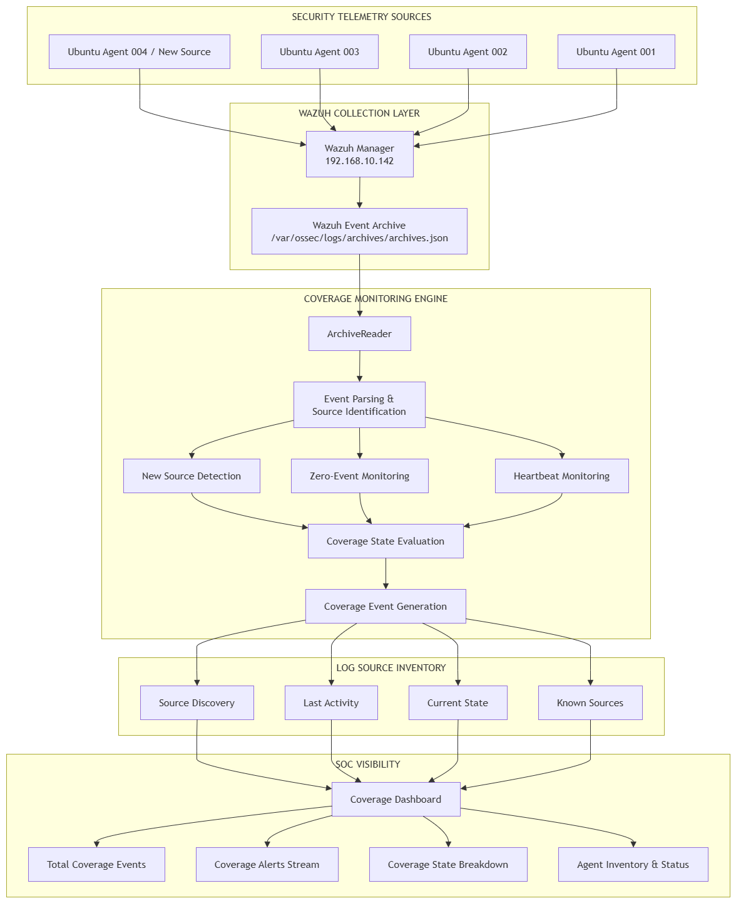
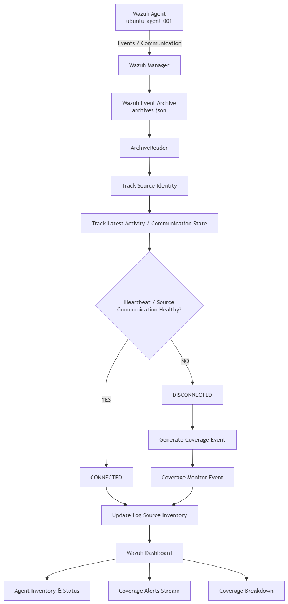
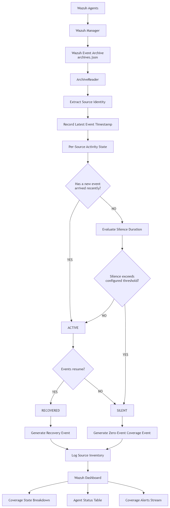
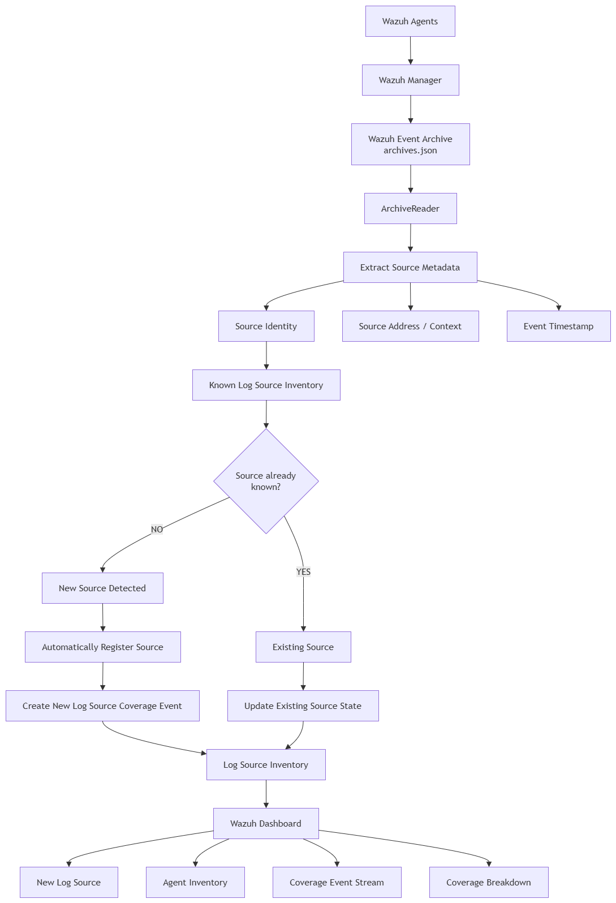
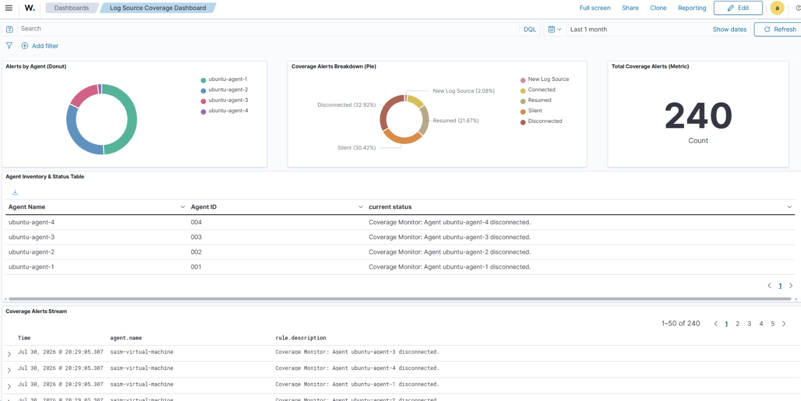
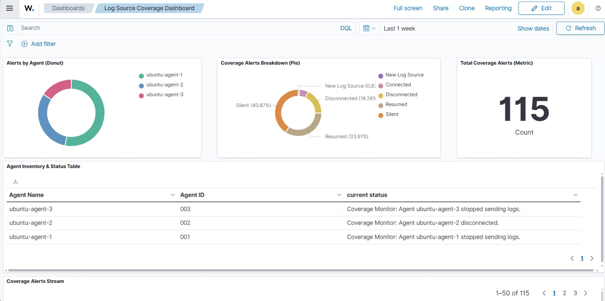

# LogSourceCoverage - Wazuh Log Source Coverage Monitoring

**LogSourceCoverage** is a lightweight monitoring layer built on top of **Wazuh** that helps Security Operations Centers identify gaps in endpoint telemetry.

A Wazuh agent being **connected** does not necessarily mean that it is actively sending security events. LogSourceCoverage monitors both the agent's heartbeat and its actual event activity to identify silent, disconnected, newly discovered, and recovered log sources. The generated coverage events are written as structured JSON and can be collected by Wazuh for alerting and dashboard visualization.

---

## Why Log Source Coverage Matters

Traditional agent monitoring often answers:

> **Is the Wazuh agent connected?**

LogSourceCoverage adds another important question:

> **Is the agent actually producing security telemetry?**

This helps identify situations where an endpoint appears healthy from an agent-status perspective but has stopped generating events, potentially creating a blind spot for the SOC.

---

## Features

* **Heartbeat Monitoring** — detects healthy, silent, and disconnected agents.
* **Zero-Event Detection** — identifies healthy agents that stop producing events.
* **New Source Detection** — detects previously unknown Wazuh sources.
* **Automatic Inventory Registration** — registers newly discovered sources.
* **Source Metadata Tracking** — keeps agent name and IP information updated.
* **Recovery Detection** — detects when a disconnected or silent source becomes active again.
* **Structured JSON Events** — produces machine-readable monitoring events.
* **Wazuh Integration** — generated events can be ingested and alerted on through Wazuh.
* **Configurable Thresholds** — monitoring intervals and inactivity thresholds can be adjusted through environment variables.

---

## Architecture



---

## How It Works

### 1. Heartbeat Monitoring

The project queries the Wazuh API to retrieve registered agents and evaluates their current state.

An agent can be classified as:

* `Healthy`
* `Silent`
* `Disconnected`

The heartbeat threshold is configurable.

---

### 2. Zero-Event Detection

An agent can remain connected to Wazuh while its telemetry pipeline has stopped producing events.

LogSourceCoverage continuously reads new events from:

```text
/var/ossec/logs/archives/archives.json
```

For each agent, the service tracks the latest observed event.

If a healthy agent produces no events for the configured threshold, it generates a `Silent` coverage event.

When events resume, a `Recovered` event is generated.

---

### 3. New Source Detection

LogSourceCoverage maintains an inventory of known Wazuh sources.

When a previously unknown agent begins producing events, the system:

1. Identifies the source.
2. Retrieves its metadata.
3. Checks the existing inventory.
4. Registers the source if it is new.
5. Generates a coverage event.

This provides visibility into new endpoints appearing in the monitored environment.

---

### 4. Recovery Detection

The system also tracks recovery conditions.

Examples include:

```text
Disconnected → Healthy
Silent       → Active
```
---

## Coverage Events

Generated events use a structured JSON format.

Example:

```json
{
  "event": "coverage_monitor",
  "timestamp": "2026-08-15T10:00:00Z",
  "level": "WARNING",
  "agent_id": "001",
  "agent_name": "ubuntu-agent",
  "message": "No events received for 1.6 minutes",
  "zero_event_state": "Silent"
}
```

Depending on the condition, events can represent:

| Condition                         | State                   |
| --------------------------------- | ----------------------- |
| Agent operating normally          | `Connected` / `Healthy` |
| Agent heartbeat lost              | `Disconnected`          |
| Agent stopped producing events    | `Silent`                |
| Previously silent source resumes  | `Recovered`             |
| Previously unknown source appears | `New Source`            |

---

## Monitoring Flow

### Heartbeat Monitoring



The heartbeat monitor uses the Wazuh API to determine whether registered agents are active and responsive.

### Zero-Event Detection



The zero-event monitor compares the latest observed event from each healthy agent against the configured inactivity threshold.

### New Source Detection



New sources are identified from newly observed events and automatically compared against the maintained source inventory.

---

## Wazuh Dashboard

The resulting coverage events can be collected by Wazuh and displayed through custom rules and dashboard visualizations.

The dashboard provides visibility into:

* Coverage events
* Alerts by agent
* Coverage state
* Agent status
* Silent sources
* Disconnected sources
* Recovered sources
* Newly discovered sources

### Dashboard View





---

## Project Structure

```text
LogSourceCoverage/
│
├── config/
│   └── log_source_inventory.example.json
│
├── docs/
│   ├── architecture.png
│   ├── heart-beat-flow.png
│   ├── new-agent-flow.png
│   └── zero-event-flow.png
│
├── logs/
│   └── coverage_monitor.example.json
│
├── screenshots/
│   ├── Dashboard-1.jpeg
│   └── Dashboard-2.jpeg
│
├── src/
│   ├── api_client.py
│   ├── archive_reader.py
│   ├── config.py
│   ├── heartbeat.py
│   ├── inventory.py
│   ├── logger.py
│   ├── new_source_detector.py
│   └── zero_event.py
│
├── service.py
├── requirements.txt
├── .gitignore
└── README.md
```

---

## Requirements

* Ubuntu 22.04+
* Python 3.10+
* Wazuh Manager 4.x
* Wazuh Dashboard
* Wazuh API enabled
* Access to the Wazuh `archives.json` event stream

---

## Installation

Clone the repository:

```bash
git clone https://github.com/MohidUmer/LogSourceCoverage.git
cd LogSourceCoverage
```

Install the required Python packages:

```bash
python3 -m pip install -r requirements.txt
```

Create a `.env` file in the project root:

```env
WAZUH_API_URL=https://<wazuh-manager>:55000
WAZUH_USERNAME=<username>
WAZUH_PASSWORD=<password>

VERIFY_SSL=False
REQUEST_TIMEOUT=10

CHECK_INTERVAL=30
HEARTBEAT_THRESHOLD=300
ZERO_EVENT_THRESHOLD=1
```

---

## Running the Monitor

Start the service with:

```bash
python3 service.py
```

The monitor will periodically:

1. Query Wazuh for agent states.
2. Read newly appended events from `archives.json`.
3. Track the latest event for each agent.
4. Detect heartbeat failures.
5. Detect zero-event conditions.
6. Detect newly discovered sources.
7. Update the source inventory.
8. Generate structured coverage events.

---

## Configuration

The following variables can be configured through `.env`:

| Variable               | Description                                              |       Default |
| ---------------------- | -------------------------------------------------------- | ------------: |
| `WAZUH_API_URL`        | Wazuh API endpoint                                       |      Required |
| `WAZUH_USERNAME`       | Wazuh API username                                       |      Required |
| `WAZUH_PASSWORD`       | Wazuh API password                                       |      Required |
| `VERIFY_SSL`           | Verify Wazuh API TLS certificate                         |       `False` |
| `REQUEST_TIMEOUT`      | API request timeout in seconds                           |          `10` |
| `CHECK_INTERVAL`       | Monitoring polling interval                              |  `30` seconds |
| `HEARTBEAT_THRESHOLD`  | Time before an agent is considered silent                | `300` seconds |
| `ZERO_EVENT_THRESHOLD` | Time without events before a source is considered silent |    `1` minute |
